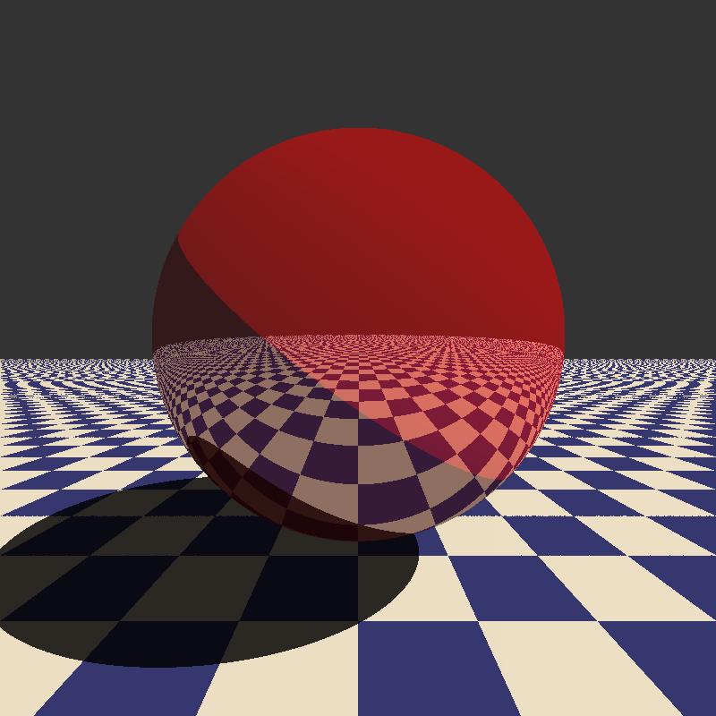

# C++ Raytracer
It can only render spheres and planes right now. Uses a materials system but no textures yet.
Saves the render as a .ppm image.

# Sample images

*One of the first renders*

*Added reflections and checkerboard*

*Better shading, fresnel, fog*